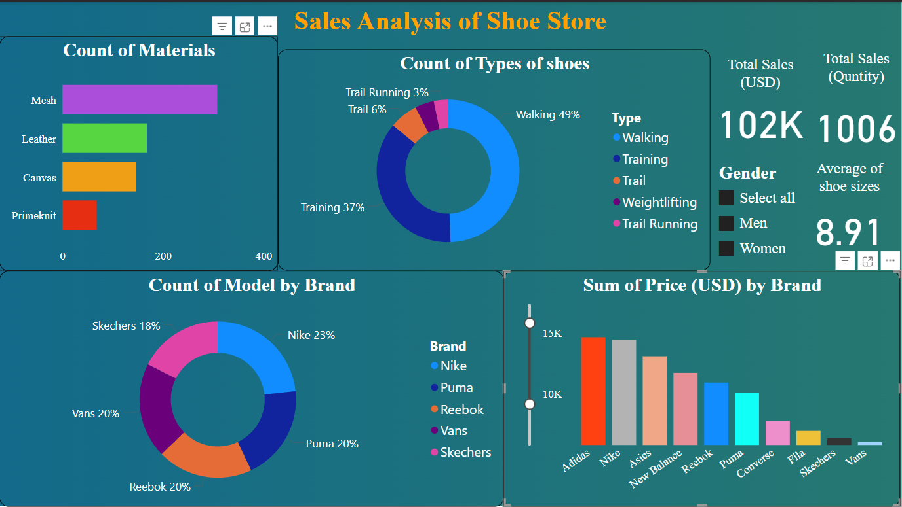

# 🛍️ Sales Analysis of Shoe Store (Power BI Dashboard)

This project presents an interactive **Sales Analysis Dashboard** for a shoe store, built using **Microsoft Power BI**. It helps visualize and understand key business metrics including total sales, product performance, and customer buying patterns.

---

## 📊 Dashboard Highlights

### 🔹 1. Sales Overview
- **Total Sales (USD):** $102K
- **Total Quantity Sold:** 1006 Units
- **Average Shoe Size:** 8.91
- **Gender Filter:** Men / Women / All

### 🔹 2. Shoe Type & Material Analysis
- **Shoe Types:** Walking, Training, Trail, Weightlifting, Trail Running
- **Material Usage:** Mesh, Leather, Canvas, Primeknit

### 🔹 3. Brand Performance
- **Model Count by Brand:** Nike, Puma, Reebok, Vans, Skechers
- **Revenue by Brand:** Adidas, Nike, Asics, etc.

### 🔹 4. Interactive Filters
- Gender selection and price range sliders enable dynamic insights
- Visual elements are interconnected for real-time updates

---

## 📌 Key Insights
- Walking shoes account for 49% of sales
- Mesh is the most used material
- Nike holds the largest model count (23%)
- Adidas leads in total sales revenue

## 🛠️ Tools & Technologies
- Power BI Desktop
- Interactive Charts (Bar, Donut, Slicers)

## 📷 Dashboard Preview

